# Capstone-Project-Introduction-to-Cloud-Computing-DOCUMENTATION

This project focuses on adhering to top-tier software development and deployment standards. Key practices include efficient branch management, thorough code reviews through pull requests, and the implementation of strong continuous integration and continuous deployment (CI/CD) processes.

### **Objectives:**
1. Select and download a suitable e-commerce website template from a reliable source.
2. Set up an Amazon EC2 instance to host the e-commerce platform for public accessibility.
3. Utilize Git to track changes, manage code versions, and facilitate collaboration.

### **Tools Utilized:**
- **Git:** For version control and managing project history.
- **GitHub:** For hosting the repository and facilitating collaboration.
- **Visual Studio Code:** As the integrated development environment for writing and editing code.
- **Markdown:** For creating structured and readable documentation.
- **Snipaste:** For capturing and annotating screenshots.
- **AWS:** Used to set up Amazon EC2 instance to host the e-commerce platform

The following snapshots provide a detailed visualization of the commands executed to accomplish these tasks, showcasing the practical application of the tools and techniques utilized to achieve the project objectives as well as a detailed information on the challenges faced and solution.

### 1.1. Initialize Git Repository
- Begin by creating a project directory named **MarketPeack_Ecommerce**

- Inside this directory, initialize a Git repository to manage your version control.
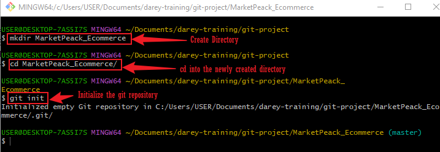

### 1.2. Obtain and Prepare the E-Commerce website Template
- Download a Website Template: I Visited Tooplate free template resource, and downloaded a e-commerce website template via the link: https://www.tooplate.com/view/2130-waso-strategy#google_vignette

- Scroll down and click on **download**
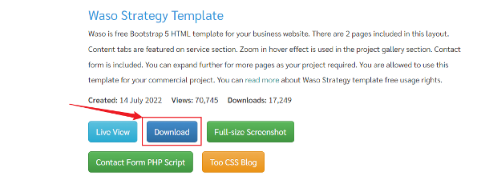

- Prepare the Website Template: Extract the downloaded template into your project directory, **MarketPeak_Ecommerce**
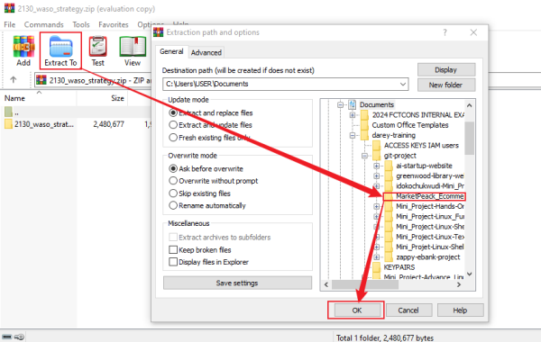

### 1.3. Stage and Commit the Template to Git
- Add your website files to the Git repository

    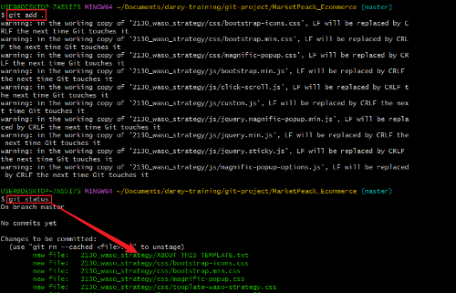

- Set your Git global configuration with your username and email and Commit your changes with a clear, descriptive message.
    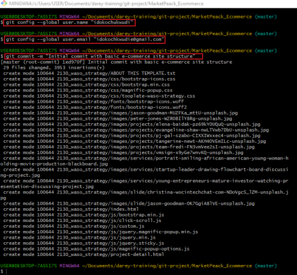

### 1.4 Push the code to your GitHub repository
After initializing my Git repository and adding my e-commerce website. the next step is to push my code to a remote repository on GitHub. This step is crucial for version control and collaboration.

- Create a Remote Repository on GitHub: I will log into my GitHub account and create a new repository named **MarketPeak_Ecommerce**, ensuring it is not initialized with a README, .gitignore, or license.

    

    

- Link My Local Repository to GitHub: In my terminal, within my project directory, I would add the remote repository URL to my local repository configuration.

**Step 1:** Open your GitHub account and navigate to your newly created repository, Click on Code then copy the HTTPS URL

**Step 2:** Link my Local Repository to GitHub: In my terminal, within my project directory, I would add the remote repository URL I just copied with a preceding command **git remote add origin**

- Push My Code: Upload my local repository content to GitHub

    

At this point, I encountered an error stating **Branch Name Does Not Match**, which occurred because I was on the master branch instead of the main branch. 

**To resolve** this, I can either rename my current branch to main or push to the master branch instead.

**Option A-Rename master to main:** To rename the current branch to main, I can execute the following commands:

`git branch -m master main`

`git push -u origin main`

**Option B- Push to master:** If I choose to keep the branch as master, I can push to master with the following command:

`git push -u origin master`

- In my case, I opted for **Option A**, which allowed me to push my commits from the local main branch to the remote repository on GitHub. This enabled me to store my project in the cloud and share it with others.

### 2. AWS Deployment
To deploy **MarketPeak_Ecommerce** platform, I will start by setting up an Amazon EC2 instance:

- Log in to the AWS Management Console.: Here, I will log in using an AWS IAM user account with the EC2 policy attached, as it is best practice to avoid working with the root account in AWS.

- Launch an EC2 instance using an **Amazon Linux AMI**

- Connect to the instance using SSH.

**Issues Encountered While Trying to Connect to My Instance:**

I attempted to connect to my instance using the default name ubuntu@<ip-address>, which I had been using for my Ubuntu instance. However, I was unable to connect because the username was incorrect, as shown below:

### **Solution**:

I needed to ensure that I was using the correct username. For **Ubuntu** instances, the username is typically `ubuntu`, but for **Amazon Linux AMI** instances (which I am trying to connect to), the username is usually `ec2-user`. Therefore, the command below helped me successfully connect to my instance.

### 2.2. Clone the repository on the Linux Server.
Before deploying my e-commerce platform, I need to clone the GitHub Repository to my AWS EC2 instance. This process involves authenticating with GitHub and choosing between two primary methods of cloning a repository: SSH and HTTPS.

### To see the ssh or http link to clone your repository
1. Navigate to your repository in github console and Select the `code` as highlighted in the image below.
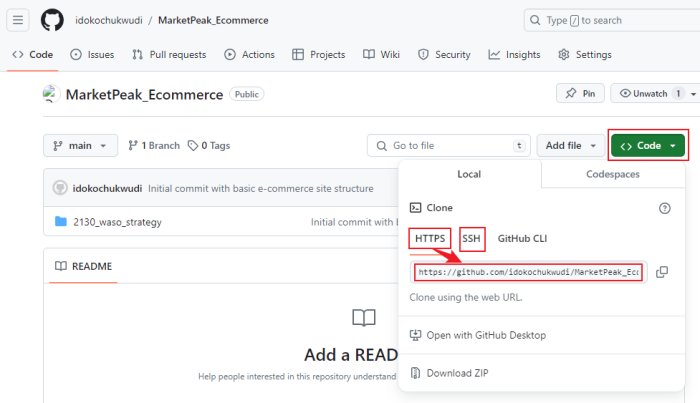

**SSH Method:**
- On my EC2 instance, I would generate SSH keypair using ssh-keygen

    

- Display and Copy your public key

    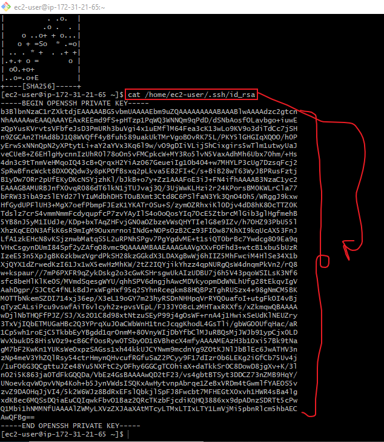

- Add the SSH public key to your GitHub account.

**STEP 1:** Log in and click on your avata, then settings

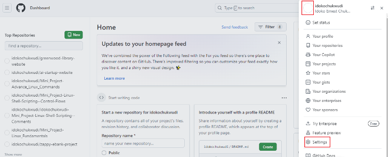

**STEP 2:** Click on `SSH and GPG keys`

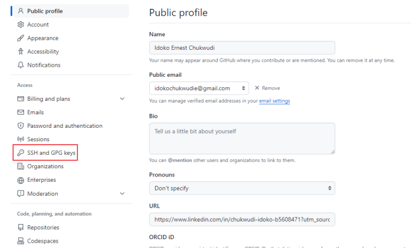

**STEP 3:** Click on `New SSH key`

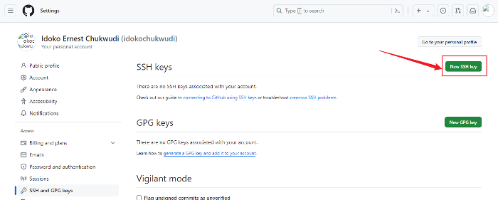

**STEP 4:** Enter your title on the `Title` field e.g `mysshkey` then paste the keys that was generated by the `ssh-keygen`, then click on `Add SSH key`

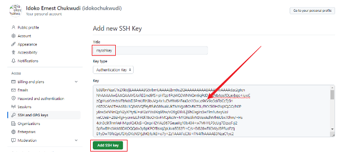

**NOTE:** You will be required to login back to your account

### **Problems identified and solusion**
At first when I pasted the key that was generated, I was presented with an error message **Key is invalid. You must supply a key in OpenSSH public key format.** which indicates that the SSH key I am trying to add to GitHub is not in the correct format. GitHub requires SSH keys to be in the OpenSSH public key format.

### Steps to Resolve
1. **Generate a New SSH Key:**
As I don't have an SSH key in the correct format, I can generate a new one using the following command:

    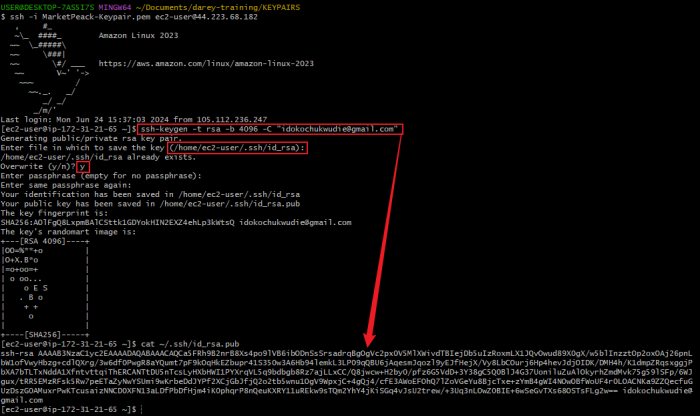

This command will display the public key in the terminal. I ensured that I copied the entire key, from the beginning with `ssh-rsa` to the end with my `email address`.

- By following the previous method for generating and adding keys to my GitHub account, I should see a success message similar to the one shown below.

    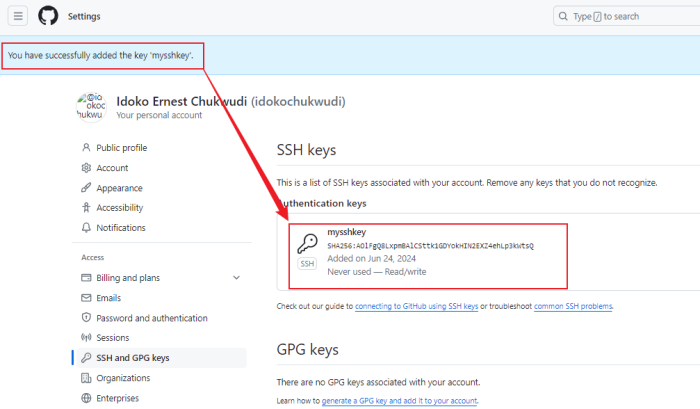

- Use the SSH clone URL to clone the repository

    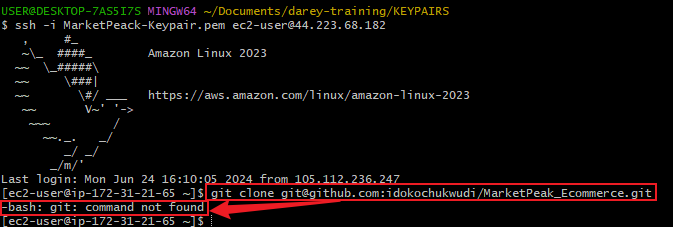

### Identified Issues and Solutions

The error message `-bash: git: command not found` suggests that Git is not installed on my Amazon Linux instance. To resolve this, I can install Git by following these steps:

**STEP 1** First, update the package index to ensure I have the latest information on the available packages:

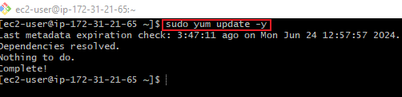

**STEP 2:** Install Git:
Install Git using the `yum` package manager:

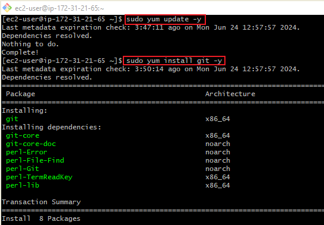

**STEP 3:** Verify the Installation:
After the installation is complete, verify that Git is installed correctly by checking its version:

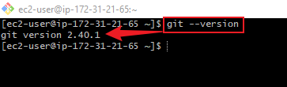

### **Cloning the Repository**
Now that Git is installed, I can clone my repository using the following command:

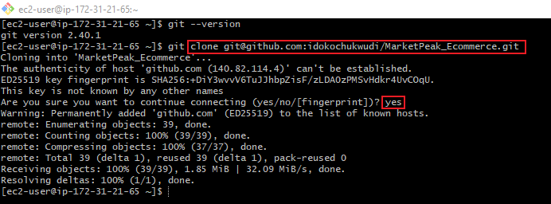

### **HTTPS Method:**
For repositories that you plan to clone without setting up SSH keys, use the HTTPS URL. GitHub will prompt for your username and password:

`git clone https://github.com/idokochukwudi/MarketPeak_Ecommerce.git`

### 2.3. Install a Web Server on EC2
**Apache HTTP Server (httpd)** is a widely used web server that serves HTML files and content over the internet. Installing it on my Amazon Linux EC2 server allows me to host **MarketPeak E-commerce** site:

- Install Apache web server on the EC2 instance. **Note** that `httpd` is the software name for Apache on systems using yum package manager.

**STEP 1:** Update the linux server

**STEP 2:** Install httpd (Apache)

**STEP 3:** Start the web server and ensure it automatically starts on server boot.

### **2.4. Configure httpd for Website**
To serve the website from the EC2 instance, I will have to configure **httpd** to point to the directory on the Linux server where the website code files are stored. Usually in **/var/www/html**.

- **Prepare the Web Directory:** Clear the default httpd web directory and copy **MarketPeak Ecommerce** website files to it.

The directory **/var/www/html/** is a standard directory structure on Linux Systems that host web content, particularly for the **Apache HTTP Server**

When I installed Apache on a Linux system, the installation process automatically creates this directory. It's designated as the default document root in Apache's configuration, meaning that Apache is set up to serve web files (such as HTML, CSS, and JavaScript files) located in this directory to visitors of my website.

- **Reload httpd:** Apply the changes by reloading the httpd service.

    

### **2.5. Access Website from Browser**
- With httpd configured and website files in place, **Market-Peak Ecommerce** platform is now live on the internet:
- I opened a web browser and access the public IP of my EC2 instance to view the deployed website

### 3. Continuous Integration and Deployment Workflow
To ensure a smooth workflow for developing, Testing, and deploying my e-commerce platform, I would follow this structured approach. It covers making changes in a development environment, utilizing version control with Git, and deploying updates to my production server on AWS.

### **STEP 1:** Developing New Features
- Create a Development Branch: I will begin my development work by creating a separate branch. This isolates new features from the stable version of my website.

- Implement Changes: On the development branch, I will edit some features. This might include updating web pages.

#### **Implement changes using visual studio code**
- I will open Visual Studio Code on my local machine and then connect to my EC2 instance.

- Open `index.html` with the `nano text editor` using the command nano `index.html`, and make a few changes.

### **STEP 2:** Version Control with Git
- Stage My Changes: After making my changes, I will add them to the staging area in Git, preparing the changes for a commit.

- Commit My Changes:Securely save my changes in the Git repository with a commit. Including a descriptive message about the updates.

- Push Changes to GitHub: Upload my development branch with the new changes to GitHub. This enables collaboration and version tracking.

### **Step 3:** Pull Requests and Merging to the Main branch
- Create a Pull Request (PR): On GitHub, create a pull request to merge the development branch into the main branch. This process is crucial for code review and maintaining code quality.

    
    

- Review and Merge the PR: I reviewed the changes for any potential issues and, once satisfied, merged the pull request into the main branch, incorporating the new changes into the production codebase.

### **STEP 4:** Deploying Updates to the Production Server

- Pull the Latest Changes on the Server: SSH into my AWS EC2 instance where the production website is hosted. Navigate to the website's directory and pull the latest changes from the main branch.

    

- Restart the Web Server (if necessary): Depending on the nature of the updates, I may need to restart the web server to apply the changes.
    

### **STEP 5:** Testing the New Changes
- Access the Website: I will Open a new browser and navigate to the public IP addres of my EC2 instance. Test the new changes to ensure they reflect as expected in the live environment.

The highlighted alterations on the webpage above demonstrate the effective execution of a Continuous Integration and Deployment Workflow.

### **Conclusion**
The project emphasizes adherence to high-quality software development and deployment standards. Key practices include efficient branch management, rigorous code reviews via pull requests, and robust implementation of continuous integration and continuous deployment (CI/CD) processes.

### **Objectives of the project:**

- Selection and download of an appropriate e-commerce website template from a reputable source.
- Setting up an Amazon EC2 instance to host the e-commerce platform for public access.
- Using Git for version control, code management, and team collaboration.

The tools utilized encompass Git for version control, GitHub for repository hosting and collaboration, Visual Studio Code and Markdown for documentation, Snipaste for image annotation, and AWS for setting up the hosting environment.

The snapshots provided visually illustrate the execution of tasks, demonstrating practical application of these tools and techniques.

Challenges encountered during the process include branch naming discrepancies and SSH key formatting issues, with corresponding solutions for each.

Deployment on AWS involves setting up an EC2 instance, installing Apache HTTP Server, configuring it to host the e-commerce platform, and accessing the deployed website via the public IP address.

The project also incorporates a structured CI/CD workflow involving development branch creation, feature implementation, Git version control, pull requests for code review, merging into the main branch, and deploying updates to the production server. Testing of new changes ensures functionality and correctness in the live environment.

